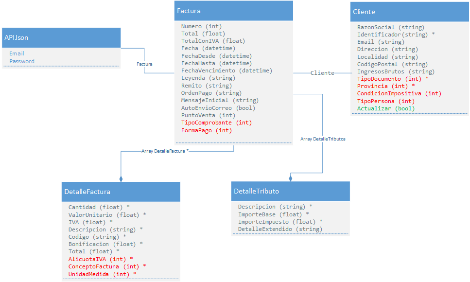

# iFactura - API de Integración

## Introducción
Si Ud. desea incorporar a su sistema de gestión la funcionalidad de la factura electrónica, cumpliendo con todos los requisitos que requiere la normativa vigente y no dispone de los recursos necesarios para implementarlo de forma correcta en términos de programación y contables, mantenerlo actualizado y vigente frente a los futuros cambios de la normativa, le ofrecemos usar en conjunto con nuestro servicio web, nuestra exclusiva API de integración.

Ud. puede comenzar a emitir facturas electrónicas validadas por AFIP desde su propio sistema de gestión en muy poco tiempo, aprovechando además las ventajas de nuestros servicios, pudiendo dedicarse completamente a su negocio y sus clientes.

Nuestra API de integración se basa en la comunicación de los datos mediante peticiones HTTP, codificando el contenido de los mensajes según la normativa JSON.

Ud. como cliente cuenta con soporte técnico tanto para la implementación en conjunto con su desarrollador, asi como también para la puesta a punto del servicio.

## Requisitos
Para poder hacer uso de la API, se requiere lo siguiente:
* Cuenta de usuario de iFactura con un plan de servicio contratado y activo.
* Acceso a Internet para la generación de las peticiones HTTP.
* Posibilidad en su sistema de enviar información en formato JSON cumpliendo con los datos más adelante descriptos.

## Novedades

* A partir del 1º de Julio de 2021 los Responsables Inscriptos que facturen a Monotributistas (con CUIT y condición impositiva declarada) serán automáticamente emitidos como comprobantes tipo "A" en lugar de "B". Esta es una modificación reciente del Decreto 280/97, artículo 39, sustituído por la Ley 27.618 de Régimen de sostenimiento e inclusión fiscal para pequeños contribuyentes.

## Entorno de pruebas
Para utilizar un sandbox de la versión oficial, deberás abrir un ticket en soporte técnico solicitando la activación del mismo.

## APIS Disponibles
Las siguientes peticiones API son las que puede integrar con su sistema

### EmitirFactura
Este procedimiento permite emitir una nueva factura electrónica, la cual será validada online por AFIP con su respectivo CAE y almacenada en iFactura. Este procedimiento cumple con todas las normativas vigentes y respeta las mismas validaciones de datos que se realizan de manera online al ser utilizado vía web. 
* **URL:** https://app.ifactura.com.ar/API/EmitirFactura 
* **Método:** POST
* **Codificación:** JSON  


Comentarios:
* Los campos marcados con asterisco(*) son obligatorios mínimamente para poder emitir facturas de tipo B menores a un total de $ 5000, ya que en los mismos no es necesario especificar todos los datos del cliente.
* Para el resto de los comprobantes, es requerido el completado de todos los datos del cliente, a excepción que el cliente ya se encuentre dado de alta en iFactura para Ud., en cuyo caso es solamente requerido el documento (CUIT/CUIL/DNI) y los demás datos serán auto-completados.
* El campo "Actualizar" es de tipo Booleano, da la posibilidad de actualizar los datos ya almacenados del cliente en iFactura, caso que el campo este en "True" y el cliente no este dado de alta, se procedera con el alta regular del cliente.
* En todos los campos de fechas, al no ser requerida la hora, deberán ser completados con valores en el siguiente formato "yyyy-mm-dd", caso contrario podrá causar un error que impida procesar su pedido y se informará de dicha situación, impidiendo la continuación de la emisión del comprobante.
* El campo "PuntoVenta" es un valor numérico (Id) en referencia al punto de venta configurado en iFactura para poder emitir comprobantes. Por ejemplo, si el punto de venta es el número 3, dicho campo deberá contener el número 3. Este campo es obligatorio.
* Los campos "Leyenda" (Leyenda del comprobante), "OrdenPago" (número de orden de pago), "MensajeInicial" (mensaje inicial enviado al cliente junto al comprobante emitido), "Remito" (número de remito asociado al comprobante), son siempre opcionales y no son obligatorios.
* El campo "AutoEnvioCorreo" es para confirmar que iFactura envíe automáticamente el comprobante emitido, vía correo electrónico.
* Los valores de tipo "float" que hacen referencia a montos son redondeados a dos dígitos decimales, en caso de que envíen de forma incorrecta. En la comunicación de los datos, el punto (.) es tomado como separador de decimales, ya que es el estándar definido en la codificación JSON.
* Los campos "Email" y "Password" del objeto "APIJson" refieren a las credenciales de su usuario en iFactura para poder emitir comprobantes. Ud. Puede crear un usuario exclusivo para el acceso mediante API, aislado de los demás usuarios de su servicio.
* El array de DetalleTributos no es obligatorio enviarlo ya que no es necesario para la mayoría de los clientes. En caso de utilizarlo, los campos que contengan * son obligatorios. El campo ImporteBase hace referencia al monto sobre el cual se aplica el tributo y el campo ImporteImpuesto es el valor que se cobra en carácter de impuesto. El campo Descripcion es el texto que el cliente verá en el comprobante. En caso de querer expresar el porcentaje del tributo a aplicar, puede sumarlo en este campo a modo informativo. El campo DetalleExtendido es opcional para dejar algún comentario dentro de iFactura (no se mostrará en el comprobante).
* Para poder descargar el comprobante emitido utilizar la siguiente url, donde {hash} debe ser sustituido por el hash que devuelve la petición.  
```
    https://app.ifactura.com.ar/Factura/ImprimirExterno/{hash}
```

### EmitirNotadesdeFactura
Este procedimiento permite generar una nota de crédito o débito, a partir de la especificación de una factura ya emitida en iFactura. Además, esta es la forma por la que la reglamentación de AFIP posibilita la anulación de una factura ya emitida. 
* **URL:** https://app.ifactura.com.ar/API/EmitirNotadesdeFactura
* **Método:** POST
* **Codificación:** JSON  


Comentarios:
* En este caso todos los campos son obligatorios.
* El campo "HashFactura" es el identificador de la factura ya emitida de la cual se desea crear la Nota. Este dato es el que devuelve el procedimiento anteriormente mencionado (EmitirFactura).
* El campo "NotaCredito" especifica si se desea emitir una Nota de Crédito (valor True) o una Nota de Débito (valor False).
* Los campos "Email" y "Password" refieren a las credenciales de su usuario en iFactura para poder emitir comprobantes. Ud. Puede crear un usuario exclusivo para el acceso mediante API, aislado de los demás usuarios de su servicio.
* Existe un campo opcional, “AutoEnviarCorreo”, que es por si se desea que, al emitir la nota correspondiente, se realice el envio de la misma por correo electrónico.

### EmitirNota
Este procedimiento permite emitir una nueva nota de crédito o débito electrónica parcial o total de un comprobante ya emitido, la cual será validada online por AFIP con su respectivo CAE y almacenada en iFactura. Este procedimiento cumple con todas las normativas vigentes y respeta las mismas validaciones de datos que se realizan de manera online al ser utilizado vía web. 
* **URL:** https://app.ifactura.com.ar/API/EmitirNota
* **Método:** POST
* **Codificación:** JSON  


Comentarios:
* Los campos marcados con asterisco(*) son obligatorios mínimamente para poder emitir notas de tipo B menores a un total de $ 5000, ya que en los mismos no es necesario especificar todos los datos del cliente.
* Para el resto de los comprobantes, es requerido el completado de todos los datos del cliente, a excepción que el cliente ya se encuentre dado de alta en iFactura para Ud., en cuyo caso es solamente requerido el documento (CUIT/CUIL/DNI) y los demás datos serán auto-completados.
* En todos los campos de fechas, al no ser requerida la hora, deberán ser completados con valores en el siguiente formato "yyyy-mm-dd", caso contrario podrá causar un error que impida procesar su pedido y se informará de dicha situación, impidiendo la continuación de la emisión del comprobante.
* El campo "PuntoVenta" es un valor numérico (Id) en referencia al punto de venta configurado en iFactura para poder emitir comprobantes. Por ejemplo, si el punto de venta es el número 3, dicho campo deberá contener el número 3. Este campo es obligatorio.
* Los campos "Leyenda" (Leyenda del comprobante), "OrdenPago" (número de orden de pago), "MensajeInicial" (mensaje inicial enviado al cliente junto al comprobante emitido), "Remito" (número de remito asociado al comprobante), son siempre opcionales y no son obligatorios.
* El campo "AutoEnvioCorreo" es para confirmar que iFactura envíe automáticamente el comprobante emitido, vía correo electrónico.
* Los valores de tipo "float" que hacen referencia a montos son redondeados a dos dígitos decimales, en caso de que envíen de forma incorrecta. En la comunicación de los datos, el punto (.) es tomado como separador de decimales, ya que es el estándar definido en la codificación JSON.
* Los campos "Email" y "Password" del objeto "APIJson" refieren a las credenciales de su usuario en iFactura para poder emitir comprobantes. Ud. Puede crear un usuario exclusivo para el acceso mediante API, aislado de los demás usuarios de su servicio.
* El campo "HashComprobanteRelacionado" hace referencia al hash del comprobante ya emitido por iFactura, el cual se debe relacionar con la nota para su correcta emisión. Caso omiso no se podrá emitir la nota.

## Tablas de sistema
Las tablas de sistema permiten normalizar la entrada de datos por la API.
El uso de un valor inválido o fuera de rango, que no esté registrado en las siguientes tablas de sistema será informado mediante un mensaje de error.

### IVA
| Id   | Porcentaje                      |
|------|---------------------------------|
| 1    | 0%                              |
| 2    | 10.5%                           |
| 3    | 21%                             |
| 4    | 27%                             |
| 5    | 5%                              |
| 6    | 2.5%                            |
| 7    | Exento                          |
| 8    | No Gravado                      |

### Concepto Factura                
| Id   | Nombre                          |
|------|---------------------------------|
| 1    | Producto                        |
| 2    | Servicio                        |

### Condición Impositiva
| Id   | Nombre                          |
|------|---------------------------------|
| 1    | Responsable Inscripto           |
| 2    | Exento                          |
| 3    | Monotributo                     |
| 4    | Consumidor Final                |

### Forma Pago
| Id   | Nombre                          |
|------|---------------------------------|
| 1    | Contado                         |
| 2    | Tarjeta de Débito               |
| 3    | Tarjeta de Crédito              |
| 4    | Cuenta Corriente                |
| 5    | Cheque                          |
| 7    | Otro                            |

### Tipo Comprobante
| Id   | Nombre                          |
|------|---------------------------------|
| 1    | Factura A                       |
| 2    | Nota de Débito A                |
| 3    | Nota de Crédito A               |
| 4    | Factura B                       |
| 5    | Nota de Débito B                |
| 6    | Nota de Crédito B               |
| 7    | Recibo A                        |
| 9    | Recibo B                        |
| 19   | Factura C                       |
| 20   | Nota de Débito C                |
| 21   | Nota de Crédito C               |
| 22   | Recibo C                        |

### Tipo Documento
| Id   | Nombre                          |
|------|---------------------------------|
| 1    | CUIT                            |
| 2    | CUIL                            |
| 3    | CDI                             |
| 4    | LE                              |
| 5    | LC                              |
| 6    | CI Extranjera                   |
| 10   | DNI                             |
| 12   | CI Policía Federal              |
| 36   | Doc. (Otro)                     |

### Tipo Persona
| Id   | Nombre                          |
|------|---------------------------------|
| 1    | Física                          |
| 2    | Jurídica                        |

### Unidad Medida
| Id   | Nombre                          |
|------|---------------------------------|
| 1    | kilogramos                      |
| 2    | metros                          |
| 3    | metros cuadrados                |
| 4    | metros cúbicos                  |
| 5    | litros                          |
| 6    | 1000 kWh                        |
| 7    | unidades                        |
| 8    | pares                           |
| 9    | docenas                         |
| 10   | quilates                        |
| 11   | millares                        |
| 12   | gramos                          |
| 13   | milimetros                      |
| 14   | mm cúbicos                      |
| 15   | kilómetros                      |
| 16   | hectolitros                     |
| 17   | centímetros                     |
| 18   | jgo. pqt. mazo naipes           |
| 19   | cm cúbicos                      |
| 20   | toneladas                       |
| 21   | dam cúbicos                     |
| 22   | hm cúbicos                      |
| 23   | km cúbicos                      |
| 24   | microgramos                     |
| 25   | nanogramos                      |
| 26   | picogramos                      |
| 27   | miligramos                      |
| 28   | mililitros                      |
| 29   | curie                           |
| 30   | milicurie                       |
| 31   | microcurie                      |
| 32   | uiacthor                        |
| 33   | muiacthor                       |
| 34   | kg base                         |
| 35   | gruesa                          |
| 36   | kg bruto                        |
| 37   | uiactant                        |
| 38   | muiactant                       |
| 39   | uiactig                         |
| 40   | muiactig                        |
| 41   | kg activo                       |
| 42   | gramo activo                    |
| 43   | gramo base                      |
| 44   | packs                           |
| 45   | seña/anticipo                   |
| 46   | otras unidades                  |
| 47   | bonificación                    |

### Provincia
| Id   | Provincia                       |
|------|---------------------------------|
| 1    | Ciudad Autónoma de Buenos Aires |
| 2    | Buenos Aires                    |
| 3    | Catamarca                       |
| 4    | Córdoba                         |
| 5    | Corrientes                      |
| 6    | Entre Ríos                      |
| 7    | Jujuy                           |
| 8    | Mendoza                         |
| 9    | La Rioja                        |
| 10   | Salta                           |
| 11   | San Juan                        |
| 12   | San Luis                        |
| 13   | Santa Fe                        |
| 14   | Santiago del Estero             |
| 15   | Tucumán                         |
| 16   | Chaco                           |
| 17   | Chubut                          |
| 18   | Formosa                         |
| 19   | Misiones                        |
| 20   | Neuquén                         |
| 21   | La Pampa                        |
| 22   | Río Negro                       |
| 23   | Santa Cruz                      |
| 24   | Tierra del Fuego                |
